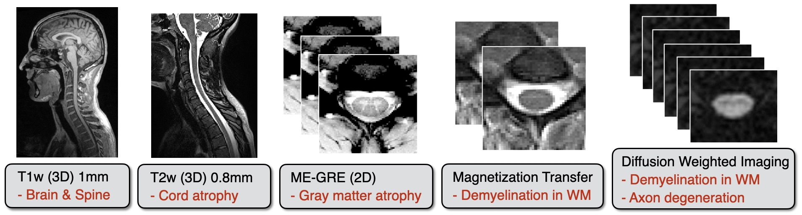

# protocols

Acquisition protocols for quantitative MRI of the spinal cord. For more information, please visit the [spine generic website](https://spine-generic.readthedocs.io/). 

The spine generic protocol is composed of the following sequences:

|                      | GE                            | Philips        | Siemens                           |
|----------------------|-------------------------------|----------------|-----------------------------------|
| T1w (3D)             | BRAVO/IR-FSPGR                | T1TFE          | MPRAGE                            |
| T2w (3D)             | CUBE                          | VISTA          | SPACE                             |
| ME-GRE (2D)          | MERGE                         | mFFE           | GRE “medic”                       |
| GRE-MT1/MT0/T1w (3D) | SPGR                          | FFE            | GRE                               |
| DWI (2D)             | SE-EPI with and without FOCUS | Zoom Diffusion | ep2d_diff with and without ZOOMit |

The recommended protocol uses product sequences. However, some old software might not have all up-to-date product sequences, and there could exist research sequences which are equivalent. When applicable, this information will be mentioned in the present document. 

All importable files are already available for the three vendors (not just the pdf), and if cross-compatibility is broken between models, each file should be there (e.g., VB: .edx vs. VD/VE: .exar for Siemens). Parameters should not be manually copied, to avoid human mistakes. If you cannot import the protocol from the already-available files, please let us know by [opening an issue](https://github.com/spine-generic/protocols/issues).

## Installation

Select the [latest release](https://github.com/spine-generic/protocols/releases) and download the zip package containing all protocols and SOP. 

## Notes

Files were previously hosted on [OSF](https://osf.io/tt4z9/), so if you wish to access a version of the protocol older than 2020-10-01, please fetch it from there.
